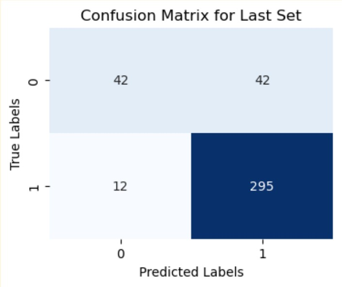

# ML application on Individual Investment Data
The goal of this project and competition is to introduce you to the process of solving a machine learning problem and working with real data(Individual Investment Data).
- Data Review
- Model Training & Testing

| Metric          | Mean                     | Variance                 |
|------------------|-------------------------|--------------------------|
| Accuracy          | 0.8721                  | 7.59e-05                 |
| Precision         | 0.8950                  | 0.0067                   |
| Recall            | 0.6559                  | 0.2154                   |
| F1 Score          | 0.9237                  | 3.57e-05                 |
| AUPRC             | 0.9388                  | 1.51e-05                 |

    

- Simplifying the model
- Competetion(train and predict on test data)
  - the *test_data_1.csv* and *test.py* are data(without labels) and standalone(process and train) 
- Ensemble learning
